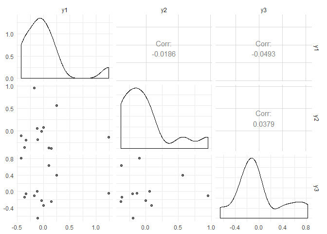

<!-- README.md is generated from README.Rmd. Please edit that file -->

# vsp

The goal of vsp is to …

## Installation

`vsp` is experimental and nascent. If you are a collaborator on the
project, you can install the development version with:

``` r
install.packages("devtools")
devtools::install_github("alexpghayes/vsp", auth_token = NEED_TO_DO_THIS)
```

You’ll need to set up a Github auth token. See the documentation in
`?remotes::install_github()` for details on how to do this.

## Example

Fitting a `vsp` factor analysis:

``` r
library(vsp)
library(Matrix)

# make a random sparse graph
M <- rsparsematrix(12, 12, nnz = 40)
M2 <- sign(M)^2

# vintage sparse pca
fa <- vsp(M2, k = 7)
fa
#> Vintage Sparse PCA Factor Analysis
#> 
#> Factors:  7 
#> Lambda_2: 0.3332 
#> 
#> Pre-Processing Options
#> 
#>  - Centering:     TRUE 
#>  - Normalization: TRUE 
#>    - Tau (rows):  3.33 [Default: Mean Degree] 
#>    - Tau (cols):  3.33 [Default: Mean Degree] 
#> 
#> Components
#> 
#> U: 12 x 7 [matrix] 
#> d: 7      [numeric] 
#> V: 12 x 7 [matrix] 
#> Z: 12 x 7 [dgeMatrix] 
#> B: 7 x 7 [dgeMatrix] 
#> Y: 12 x 7 [dgeMatrix]
```

The screeplot:

``` r
screeplot(fa)
```


``` r
project_pca(fa)
#> # A tibble: 12 x 7
#>        PC1      PC2     PC3       PC4       PC5      PC6     PC7
#>      <dbl>    <dbl>   <dbl>     <dbl>     <dbl>    <dbl>   <dbl>
#>  1 -0.161   0.144   -0.0341  0.0319   -0.00124   0.0363   0.0483
#>  2  0.117  -0.0194   0.0567  0.122     0.00812   0.0805  -0.0261
#>  3  0.0929 -0.00376  0.0292 -0.106    -0.0624    0.118    0.0323
#>  4 -0.0764 -0.0269   0.121   0.158    -0.0573   -0.0644   0.0208
#>  5  0.0959  0.0505  -0.0230 -0.0541    0.0776   -0.0969   0.0466
#>  6 -0.194   0.0975  -0.0532 -0.00679   0.0428    0.0353  -0.0484
#>  7  0.0869  0.0314  -0.154   0.00912  -0.126    -0.0592  -0.0399
#>  8  0.0630  0.00701 -0.0617  0.000553  0.000479  0.00177  0.0395
#>  9 -0.0140 -0.158   -0.105   0.0281    0.0898    0.0152  -0.0180
#> 10 -0.0654  0.0125   0.130  -0.147    -0.0201   -0.0432  -0.0404
#> 11 -0.0998 -0.212    0.0158 -0.0476   -0.0177   -0.0107   0.0160
#> 12  0.155   0.0775   0.0789  0.0118    0.0658   -0.0125  -0.0308
```

``` r
project_varimax(fa)
#> # A tibble: 12 x 7
#>    factor1 factor2 factor3 factor4 factor5  factor6 factor7
#>      <dbl>   <dbl>   <dbl>   <dbl>   <dbl>    <dbl>   <dbl>
#>  1 -1.08    0.0493 -0.221   0.107   0.197   0.0757   0.0341
#>  2  0.380   0.442  -0.386   0.145   0.180   0.117   -0.538 
#>  3 -0.0324 -0.0517  0.0177 -0.266   0.0945  1.09    -0.168 
#>  4 -0.0281 -0.0632 -0.0282  1.07    0.0553 -0.193   -0.0859
#>  5  0.0293  0.142  -0.0401 -0.0951  0.133  -0.151    1.16  
#>  6 -0.561   0.121   0.213  -0.455   0.0636 -0.546   -0.488 
#>  7  0.0761  0.0249 -0.0349 -0.0321 -1.41   -0.0468  -0.0525
#>  8 -0.118  -0.0621 -0.446  -0.0692 -0.0966  0.275    0.417 
#>  9  0.353  -0.384  -0.460  -0.451   0.176  -0.461   -0.101 
#> 10  0.117  -0.0324  0.910  -0.0325  0.0617  0.00166 -0.0227
#> 11  0.234  -0.814   0.0935  0.0855  0.158   0.0315  -0.0502
#> 12  0.388   0.708   0.128  -0.0743  0.196  -0.116    0.122
```

``` r
pairs(project_pca(fa))
```


``` r
pairs(project_varimax(fa))
```


think about how else to visualize these matrices. distributions of
loadings? am i actually plotting the loadings here or did i just do some
nonsense?

``` r
plot_simulation_test(M2, k = 3)
#> Loading required package: igraph
#> Warning: package 'igraph' was built under R version 3.5.1
#> 
#> Attaching package: 'igraph'
#> The following objects are masked from 'package:stats':
#> 
#>     decompose, spectrum
#> The following object is masked from 'package:base':
#> 
#>     union
#> `stat_bin()` using `bins = 30`. Pick better value with `binwidth`.
```


## Tidygraph integration

Details on `tidygraph` can be found
[here](https://www.data-imaginist.com/2017/introducing-tidygraph/).
Details on `ggraph` can be found
[here](https://www.data-imaginist.com/2017/ggraph-introduction-layouts/).

``` r
library(tidygraph)
#> Warning: package 'tidygraph' was built under R version 3.5.1
#> 
#> Attaching package: 'tidygraph'
#> The following object is masked from 'package:igraph':
#> 
#>     groups
#> The following object is masked from 'package:stats':
#> 
#>     filter
library(ggraph)
#> Warning: package 'ggraph' was built under R version 3.5.1
#> Loading required package: ggplot2
#> Warning: package 'ggplot2' was built under R version 3.5.1

sbm <- play_blocks(25, 25, 0.1)
```

`vsp` also works on `igraph` and `tidygraph` objects:

``` r
fa2 <- vsp(sbm, k = 5)
```

You can then add the resulting factor loadings back into the node
information about the graph:

``` r
# if you already have a vsp object
sbm_fa2 <- sbm %>% 
  bind_varimax_factors(fa2)

sbm_fa2
#> # A tbl_graph: 25 nodes and 52 edges
#> #
#> # A directed simple graph with 1 component
#> #
#> # Node Data: 25 x 5 (active)
#>   factor1 factor2 factor3 factor4 factor5
#>     <dbl>   <dbl>   <dbl>   <dbl>   <dbl>
#> 1 -0.169   0.0912  0.154   0.114   1.51  
#> 2  0.676   0.205   0.0171 -0.0121  0.993 
#> 3 -0.353   0.250  -0.178  -1.16   -0.215 
#> 4 -0.0347 -0.837   0.0637  0.215  -0.190 
#> 5 -0.649  -0.624  -0.0222  0.472   0.562 
#> 6  0.0928 -0.254   0.499  -0.692  -0.0945
#> # ... with 19 more rows
#> #
#> # Edge Data: 52 x 2
#>    from    to
#>   <int> <int>
#> 1     5     1
#> 2    12     1
#> 3    16     1
#> # ... with 49 more rows
```

If you haven’t already created a `vsp` object, that gets taken care of
for you as well:

``` r
sbm_fa3 <- sbm %>% 
  bind_varimax_factors()

sbm_fa3
#> # A tbl_graph: 25 nodes and 52 edges
#> #
#> # A directed simple graph with 1 component
#> #
#> # Node Data: 25 x 5 (active)
#>   factor1 factor2 factor3 factor4 factor5
#>     <dbl>   <dbl>   <dbl>   <dbl>   <dbl>
#> 1 -0.169   0.0912  0.154   0.114   1.51  
#> 2  0.676   0.205   0.0171 -0.0121  0.993 
#> 3 -0.353   0.250  -0.178  -1.16   -0.215 
#> 4 -0.0347 -0.837   0.0637  0.215  -0.190 
#> 5 -0.649  -0.624  -0.0222  0.472   0.562 
#> 6  0.0928 -0.254   0.499  -0.692  -0.0945
#> # ... with 19 more rows
#> #
#> # Edge Data: 52 x 2
#>    from    to
#>   <int> <int>
#> 1     5     1
#> 2    12     1
#> 3    16     1
#> # ... with 49 more rows
```

``` r
ggraph(sbm_fa2) + 
    geom_edge_fan(aes(alpha = ..index..), show.legend = FALSE) + 
    geom_node_point(aes(size = factor1)) + 
    theme_graph(foreground = 'steelblue', fg_text_colour = 'white')
#> Using `nicely` as default layout
#> Warning in grid.Call(C_textBounds, as.graphicsAnnot(x$label), x$x, x$y, :
#> font family not found in Windows font database

#> Warning in grid.Call(C_textBounds, as.graphicsAnnot(x$label), x$x, x$y, :
#> font family not found in Windows font database

#> Warning in grid.Call(C_textBounds, as.graphicsAnnot(x$label), x$x, x$y, :
#> font family not found in Windows font database

#> Warning in grid.Call(C_textBounds, as.graphicsAnnot(x$label), x$x, x$y, :
#> font family not found in Windows font database
```



## Messy scratch

``` r
library(tidyverse)

fa$B %>%
  as.matrix() %>%
  as_tibble() %>%
  mutate(row = row_number()) %>%
  gather(k, v, -row) %>%
  ggplot(aes(row, k, fill = v)) +
  geom_tile() +
  scale_fill_viridis_c()

image(fa$B)
image(fa$Z)
```
