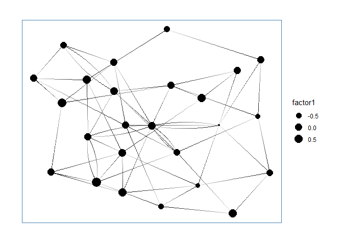

<!-- README.md is generated from README.Rmd. Please edit that file -->

# vsp

The goal of vsp is to …

## Installation

`vsp` is experimental and nascent. If you are a collaborator on the
project, you can install the development version with:

``` r
install.packages("devtools")
devtools::install_github("alexpghayes/vsp", auth_token = NEED_TO_DO_THIS)
```

You’ll need to set up a Github auth token. See the documentation in
`?remotes::install_github()` for details on how to do this.

## Example

Fitting a `vsp` factor analysis:

``` r
library(vsp)
library(Matrix)

# make a random sparse graph
M <- rsparsematrix(12, 12, nnz = 40)
M2 <- sign(M)^2

# vintage sparse pca
fa <- vsp(M2, k = 4)
fa
#> Vintage Sparse PCA Factor Analysis
#> 
#> Factors:  4 
#> Lambda_2: 0.3346 
#> 
#> Pre-Processing Options
#> 
#>  - Centering:     TRUE 
#>  - Normalization: TRUE 
#>    - Tau (rows):  3.33 [Default: Mean Degree] 
#>    - Tau (cols):  3.33 [Default: Mean Degree] 
#> 
#> Components
#> 
#> U: 12 x 4 [matrix] 
#> d: 4      [numeric] 
#> V: 12 x 4 [matrix] 
#> Z: 12 x 4 [dgeMatrix] 
#> B: 4 x 4 [dgeMatrix] 
#> Y: 12 x 4 [dgeMatrix]
```

Efficient updating when you really wanted more components

``` r
fa <- update(fa, graph = M2, k = 7)
fa
#> Vintage Sparse PCA Factor Analysis
#> 
#> Factors:  7 
#> Lambda_2: 0.3346 
#> 
#> Pre-Processing Options
#> 
#>  - Centering:     TRUE 
#>  - Normalization: TRUE 
#>    - Tau (rows):  3.33 [Default: Mean Degree] 
#>    - Tau (cols):  3.33 [Default: Mean Degree] 
#> 
#> Components
#> 
#> U: 12 x 7 [matrix] 
#> d: 7      [numeric] 
#> V: 12 x 7 [matrix] 
#> Z: 12 x 4 [dgeMatrix] 
#> B: 4 x 4 [dgeMatrix] 
#> Y: 12 x 4 [dgeMatrix]
```

The screeplot:

``` r
screeplot(fa)
```


``` r
project_pca(fa)
#> # A tibble: 12 x 7
#>         PC1      PC2      PC3      PC4      PC5      PC6     PC7
#>       <dbl>    <dbl>    <dbl>    <dbl>    <dbl>    <dbl>   <dbl>
#>  1 -0.215    0.0246  -0.0581  -0.00430  0.0377  -0.00112 -0.0506
#>  2  0.136    0.0811  -0.00481  0.146   -0.0652   0.00152 -0.0743
#>  3  0.0421  -0.146   -0.0471  -0.110   -0.0133  -0.00333 -0.0876
#>  4 -0.171    0.0500   0.0588   0.0159   0.00172  0.0706  -0.0161
#>  5 -0.0512   0.138    0.124   -0.0686  -0.0995  -0.0585   0.0406
#>  6  0.143    0.0882   0.00222 -0.109    0.0334   0.0877   0.0161
#>  7  0.0440  -0.0300  -0.0233   0.00794 -0.0495   0.0631   0.0168
#>  8  0.0131   0.118   -0.156    0.0429   0.0853  -0.0309   0.0261
#>  9  0.0302  -0.0913   0.125    0.0585   0.0856   0.0269   0.0623
#> 10 -0.0389  -0.164    0.0351   0.0627  -0.0393  -0.00500  0.0243
#> 11  0.00154 -0.0633  -0.162   -0.0187  -0.0514  -0.0455   0.0754
#> 12  0.0668  -0.00469  0.107   -0.0240   0.0744  -0.105   -0.0330
```

``` r
project_varimax(fa)
#> # A tibble: 12 x 4
#>     factor1 factor2 factor3   factor4
#>       <dbl>   <dbl>   <dbl>     <dbl>
#>  1 -0.710    0.0727 -0.278  -0.262   
#>  2  0.151   -0.130  -0.0127  0.933   
#>  3  0.340   -0.352   0.0788 -0.671   
#>  4 -0.674    0.436   0.0583 -0.0556  
#>  5  0.0170   0.878  -0.0312 -0.119   
#>  6  0.699    0.311  -0.293  -0.157   
#>  7  0.156   -0.234   0.0204  0.0459  
#>  8 -0.0906  -0.196  -0.817   0.409   
#>  9  0.00434 -0.0337  0.621   0.170   
#> 10 -0.230   -0.365   0.487  -0.0232  
#> 11 -0.00402 -0.586  -0.394  -0.241   
#> 12  0.347    0.293   0.375  -0.000422
```

``` r
pairs(project_pca(fa))
```


``` r
pairs(project_varimax(fa))
```


think about how else to visualize these matrices. distributions of
loadings? am i actually plotting the loadings here or did i just do some
nonsense?

``` r
plot_simulation_test(M2, k = 3)
#> Loading required package: igraph
#> Warning: package 'igraph' was built under R version 3.5.1
#> 
#> Attaching package: 'igraph'
#> The following objects are masked from 'package:stats':
#> 
#>     decompose, spectrum
#> The following object is masked from 'package:base':
#> 
#>     union
#> `stat_bin()` using `bins = 30`. Pick better value with `binwidth`.
```


## Tidygraph integration

Details on `tidygraph` can be found
[here](https://www.data-imaginist.com/2017/introducing-tidygraph/).
Details on `ggraph` can be found
[here](https://www.data-imaginist.com/2017/ggraph-introduction-layouts/).

``` r
library(tidygraph)
#> Warning: package 'tidygraph' was built under R version 3.5.1
#> 
#> Attaching package: 'tidygraph'
#> The following object is masked from 'package:igraph':
#> 
#>     groups
#> The following object is masked from 'package:stats':
#> 
#>     filter
library(ggraph)
#> Warning: package 'ggraph' was built under R version 3.5.1
#> Loading required package: ggplot2
#> Warning: package 'ggplot2' was built under R version 3.5.1

sbm <- play_blocks(25, 25, 0.1)
```

`vsp` also works on `igraph` and `tidygraph` objects:

``` r
fa2 <- vsp(sbm, k = 5)
```

You can then add the resulting factor loadings back into the node
information about the graph:

``` r
# if you already have a vsp object
sbm_fa2 <- sbm %>% 
  bind_varimax_factors(fa2)

sbm_fa2
#> # A tbl_graph: 25 nodes and 61 edges
#> #
#> # A directed simple graph with 1 component
#> #
#> # Node Data: 25 x 5 (active)
#>    factor1 factor2 factor3 factor4 factor5
#>      <dbl>   <dbl>   <dbl>   <dbl>   <dbl>
#> 1 -0.402   -0.0930 -0.376   0.694   -0.451
#> 2 -0.00751  0.137  -0.0458  0.317   -0.932
#> 3 -0.127   -0.230  -0.223  -0.108    0.275
#> 4 -0.108    0.230  -0.138  -0.0897  -0.731
#> 5 -0.0564  -1.35   -0.0813  0.112    0.216
#> 6 -0.127   -0.230  -0.223  -0.108    0.275
#> # ... with 19 more rows
#> #
#> # Edge Data: 61 x 2
#>    from    to
#>   <int> <int>
#> 1     7     1
#> 2    23     2
#> 3     2     3
#> # ... with 58 more rows
```

If you haven’t already created a `vsp` object, that gets taken care of
for you as well:

``` r
sbm_fa3 <- sbm %>% 
  bind_varimax_factors()

sbm_fa3
#> # A tbl_graph: 25 nodes and 61 edges
#> #
#> # A directed simple graph with 1 component
#> #
#> # Node Data: 25 x 5 (active)
#>    factor1 factor2 factor3 factor4 factor5
#>      <dbl>   <dbl>   <dbl>   <dbl>   <dbl>
#> 1 -0.402   -0.0930 -0.376   0.694   -0.451
#> 2 -0.00751  0.137  -0.0458  0.317   -0.932
#> 3 -0.127   -0.230  -0.223  -0.108    0.275
#> 4 -0.108    0.230  -0.138  -0.0897  -0.731
#> 5 -0.0564  -1.35   -0.0813  0.112    0.216
#> 6 -0.127   -0.230  -0.223  -0.108    0.275
#> # ... with 19 more rows
#> #
#> # Edge Data: 61 x 2
#>    from    to
#>   <int> <int>
#> 1     7     1
#> 2    23     2
#> 3     2     3
#> # ... with 58 more rows
```

``` r
ggraph(sbm_fa2) + 
    geom_edge_fan(aes(alpha = ..index..), show.legend = FALSE) + 
    geom_node_point(aes(size = factor1)) + 
    theme_graph(foreground = 'steelblue', fg_text_colour = 'white')
#> Using `nicely` as default layout
#> Warning in grid.Call(C_textBounds, as.graphicsAnnot(x$label), x$x, x$y, :
#> font family not found in Windows font database

#> Warning in grid.Call(C_textBounds, as.graphicsAnnot(x$label), x$x, x$y, :
#> font family not found in Windows font database

#> Warning in grid.Call(C_textBounds, as.graphicsAnnot(x$label), x$x, x$y, :
#> font family not found in Windows font database

#> Warning in grid.Call(C_textBounds, as.graphicsAnnot(x$label), x$x, x$y, :
#> font family not found in Windows font database
```



## Messy scratch

``` r
library(tidyverse)

fa$B %>%
  as.matrix() %>%
  as_tibble() %>%
  mutate(row = row_number()) %>%
  gather(k, v, -row) %>%
  ggplot(aes(row, k, fill = v)) +
  geom_tile() +
  scale_fill_viridis_c()

image(fa$B)
image(fa$Z)
```
