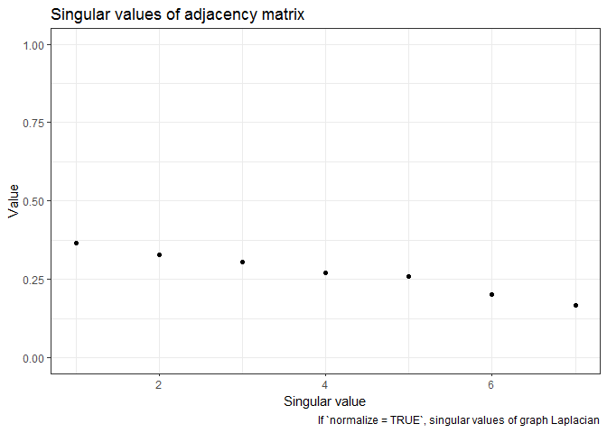
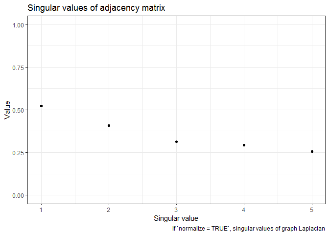

<!-- README.md is generated from README.Rmd. Please edit that file -->

# vsp

The goal of vsp is to …

## Installation

`vsp` is experimental and nascent. If you are a collaborator on the
project, you can install the development version with:

``` r
install.packages("devtools")
devtools::install_github("alexpghayes/vsp", auth_token = NEED_TO_DO_THIS)
```

You’ll need to set up a Github auth token. See the documentation in
`?remotes::install_github()` for details on how to do this.

## Example

Fitting a `vsp` factor analysis:

``` r
library(vsp)
library(Matrix)

# make a random sparse graph
M <- rsparsematrix(12, 12, nnz = 40)
M2 <- sign(M)^2

# vintage sparse pca
fa <- vsp(M2, k = 7)
fa
#> Vintage Sparse PCA Factor Analysis
#> 
#> Factors:  7 
#> Lambda_2: 0.3276 
#> 
#> Pre-Processing Options
#> 
#>  - Centering:     TRUE 
#>  - Normalization: TRUE 
#>    - Tau (rows):  3.33 [Default: Mean Degree] 
#>    - Tau (cols):  3.33 [Default: Mean Degree] 
#> 
#> Components
#> 
#> U: 12 x 7 [matrix] 
#> d: 7      [numeric] 
#> V: 12 x 7 [matrix] 
#> Z: 12 x 7 [dgeMatrix] 
#> B: 7 x 7 [dgeMatrix] 
#> Y: 12 x 7 [dgeMatrix]
```

The screeplot:

``` r
screeplot(fa)
```



``` r
project_pca(fa)
#> # A tibble: 12 x 7
#>         PC1      PC2     PC3      PC4      PC5        PC6     PC7
#>       <dbl>    <dbl>   <dbl>    <dbl>    <dbl>      <dbl>   <dbl>
#>  1  0.00633 -0.00213  0.109  -0.0422   0.0938   0.0950    -0.0913
#>  2 -0.105   -0.0867  -0.0943  0.113   -0.0160   0.0683    -0.0153
#>  3 -0.0504  -0.0849   0.0671 -0.196   -0.0725  -0.0107     0.0315
#>  4 -0.0251  -0.225   -0.0600  0.0224  -0.00463  0.0000794  0.0253
#>  5  0.0809   0.0134  -0.0711 -0.00885  0.00526 -0.0533    -0.0636
#>  6  0.155    0.0799  -0.121  -0.00582  0.00302  0.0187     0.0542
#>  7 -0.162    0.0792  -0.0299 -0.00185 -0.0625  -0.0891    -0.0368
#>  8 -0.122    0.0914  -0.0410 -0.0452   0.167    0.00725    0.0672
#>  9  0.0546   0.109   -0.0671 -0.0377  -0.105    0.0596    -0.0279
#> 10  0.163   -0.0610   0.0428  0.0259   0.0774  -0.0978    -0.0187
#> 11  0.0971   0.0184   0.145   0.0677  -0.0610   0.0353     0.0616
#> 12 -0.0934   0.0684   0.121   0.108   -0.0247  -0.0334     0.0136
```

``` r
project_varimax(fa)
#> # A tibble: 12 x 7
#>    factor1  factor2 factor3  factor4  factor5  factor6   factor7
#>      <dbl>    <dbl>   <dbl>    <dbl>    <dbl>    <dbl>     <dbl>
#>  1 -0.0150  0.0973  -0.0334  0.0350  -0.00223  0.0197  -1.34    
#>  2 -0.0836 -0.749   -0.131   0.543   -0.118    0.581   -0.0428  
#>  3 -0.0136 -0.0335  -0.0139 -1.12    -0.0351   0.0756   0.0253  
#>  4  0.0923 -1.06    -0.0706 -0.172   -0.123   -0.115    0.201   
#>  5  0.184   0.249   -0.647   0.234   -0.390   -0.407    0.00783 
#>  6  0.817   0.227    0.107   0.212    0.145    0.0435   0.413   
#>  7 -0.676   0.336   -0.568  -0.0225  -0.0900   0.149    0.387   
#>  8  0.0434  0.0593  -0.0892  0.0260   1.07     0.0403   0.00370 
#>  9  0.327   0.381   -0.0898  0.0167  -0.339    0.492   -0.000494
#> 10  0.0487  0.00659 -0.0138  0.119   -0.114   -0.913    0.0133  
#> 11 -0.0197  0.106    1.02   -0.00627 -0.191    0.00491  0.0848  
#> 12 -0.702   0.178    0.400   0.247    0.0299   0.0153   0.136
```

``` r
pairs(project_pca(fa))
```


``` r
pairs(project_varimax(fa))
```


think about how else to visualize these matrices. distributions of
loadings? am i actually plotting the loadings here or did i just do some
nonsense?

``` r
plot_simulation_test(M2, k = 3)
#> Loading required package: igraph
#> Warning: package 'igraph' was built under R version 3.5.1
#> 
#> Attaching package: 'igraph'
#> The following objects are masked from 'package:stats':
#> 
#>     decompose, spectrum
#> The following object is masked from 'package:base':
#> 
#>     union
#> `stat_bin()` using `bins = 30`. Pick better value with `binwidth`.
```


## Tidygraph integration

``` r
library(tidygraph)
#> Warning: package 'tidygraph' was built under R version 3.5.1
#> 
#> Attaching package: 'tidygraph'
#> The following object is masked from 'package:igraph':
#> 
#>     groups
#> The following object is masked from 'package:stats':
#> 
#>     filter
library(ggraph)
#> Warning: package 'ggraph' was built under R version 3.5.1
#> Loading required package: ggplot2
#> Warning: package 'ggplot2' was built under R version 3.5.1

sbm <- play_blocks(25, 25, 0.1)
```

``` r
sbm_fa <- sbm %>% 
  bind_varimax_factors()

sbm_fa
#> # A tbl_graph: 25 nodes and 61 edges
#> #
#> # A directed simple graph with 1 component
#> #
#> # Node Data: 25 x 5 (active)
#>   factor1 factor2 factor3 factor4 factor5
#>     <dbl>   <dbl>   <dbl>   <dbl>   <dbl>
#> 1  -0.498  -0.520  0.295  -0.189   0.0763
#> 2   0.238  -0.216 -0.757   0.149  -0.0667
#> 3   0.671  -0.118  0.822  -0.227  -0.413 
#> 4   0.133   0.788 -0.420  -0.319   0.153 
#> 5   0.275  -0.634  0.268  -0.516  -0.641 
#> 6  -1.05    0.141  0.0586 -0.0812 -0.447 
#> # ... with 19 more rows
#> #
#> # Edge Data: 61 x 2
#>    from    to
#>   <int> <int>
#> 1    12     1
#> 2    19     1
#> 3    14     3
#> # ... with 58 more rows
```

``` r
ggraph(sbm_fa) + 
    geom_edge_fan(aes(alpha = ..index..), show.legend = FALSE) + 
    geom_node_point(aes(size = factor1)) + 
    theme_graph(foreground = 'steelblue', fg_text_colour = 'white')
#> Using `nicely` as default layout
#> Warning in grid.Call(C_textBounds, as.graphicsAnnot(x$label), x$x, x$y, :
#> font family not found in Windows font database

#> Warning in grid.Call(C_textBounds, as.graphicsAnnot(x$label), x$x, x$y, :
#> font family not found in Windows font database

#> Warning in grid.Call(C_textBounds, as.graphicsAnnot(x$label), x$x, x$y, :
#> font family not found in Windows font database

#> Warning in grid.Call(C_textBounds, as.graphicsAnnot(x$label), x$x, x$y, :
#> font family not found in Windows font database
```



## Messy scratch

``` r
library(tidyverse)

fa$B %>%
  as.matrix() %>%
  as_tibble() %>%
  mutate(row = row_number()) %>%
  gather(k, v, -row) %>%
  ggplot(aes(row, k, fill = v)) +
  geom_tile() +
  scale_fill_viridis_c()

image(fa$B)
image(fa$Z)
```
