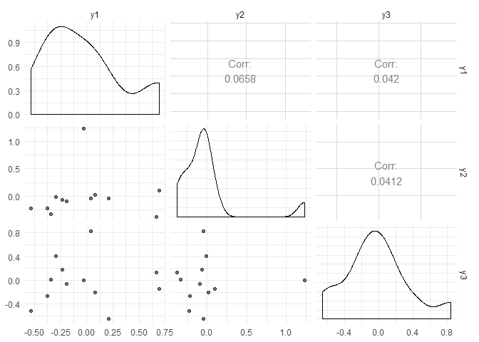

<!-- README.md is generated from README.Rmd. Please edit that file -->

<!-- badges: start -->

[](https://www.tidyverse.org/lifecycle/#experimental)
<!-- badges: end -->

**Disclaimer:** This package is a work in progress. Some basic
functionality is available, but the API is subject to change, as are
some (minor) computational details. Code to reproduce the results in
*Vintage Factor Analysis with Varimax Performs Statistical Inference* is
[available here](https://github.com/RoheLab/vsp-paper).

# vsp

The goal of `vsp` to enable fast, spectral estimation of latent factors
in random dot product graphs. Under mild assumptions, the `vsp`
estimator is consistent for (degree-corrected) stochastic blockmodels,
(degree-corrected) mixed-membership stochastic blockmodels,
degree-corrected overlapping stochastic blockmodels.

More generally, the `vsp` estimator is consistent for random dot product
graphs that can be written in the form

    E(A) = Z B Y^T

where `Z` and `Y` satisfy the varimax assumptions of \[1\]. `vsp` works
on directed and undirected graphs, and on weighted and unweighted
graphs.

## Installation

You can install the development version of `vsp` with:

``` r
install.packages("devtools")
devtools::install_github("RoheLab/vsp")
```

## Example

Obtaining estimates from `vsp` is straightforward. We recommend
representing networks as [`igraph`](https://igraph.org/r/) objects or
(sparse) `Matrix` objects from the
[`Matrix`](https://cran.r-project.org/web/packages/Matrix/index.html)
package (see also `?Matrix`).

Once you have your network in one of these formats, you can get
estimates by calling the `vsp()` function. The result is an object of
class `"vsp"`.

``` r
library(vsp)
library(Matrix)

# create a random sparse adjacency matrix
M <- sign(rsparsematrix(12, 12, nnz = 40))^2

# vintage sparse pca
fa <- vsp(M, k = 5)
fa
#> Vintage Sparse PCA Factor Analysis
#> 
#> Nodes (n):   12
#> Factors (k): 5
#> Lambda[k]:   0.252
#> 
#> Pre-Processing Options
#> 
#>  - Centering:     TRUE 
#>  - Normalization: TRUE 
#>    - Tau (rows):  3.33 [Default: Mean Degree] 
#>    - Tau (cols):  3.33 [Default: Mean Degree] 
#> 
#> Components
#> 
#> U: 12 x 5 [matrix] 
#> d: 5      [numeric] 
#> V: 12 x 5 [matrix] 
#> Z: 12 x 5 [dgeMatrix] 
#> B: 5 x 5 [dgeMatrix] 
#> Y: 12 x 5 [dgeMatrix]
```

`vsp()` is an S3 generic, so can similarly just pass an `igraph` object.
This means that `vsp` also supports
[`tidygraph`](https://github.com/thomasp85/tidygraph), which is built on
top of `igraph`. We use `enron` network from `igraphdata` package to
demonstrate this functionality.

``` r
library(igraph)
data(enron, package = "igraphdata")

enron
#> IGRAPH 64ec693 D--- 184 125409 -- Enron email network
#> + attr: LDC_names (g/c), LDC_desc (g/c), name (g/c), Citation (g/c),
#> | Email (v/c), Name (v/c), Note (v/c), Time (e/c), Reciptype (e/c),
#> | Topic (e/n), LDC_topic (e/n)
#> + edges from 64ec693:
#>  [1]  25->154  25->154  30-> 30  30-> 30  30-> 30  30-> 30  39-> 39  52-> 67
#>  [9]  52-> 67  52-> 67  52-> 67  61->100  61->100  61->163  61->163  61->166
#> [17]  61->166  61->170  64-> 59  64-> 59  64-> 64  64-> 64  64->147  64->147
#> [25]  64->164  64->164  64->168  66-> 66  66-> 66  67->129  67->129  67->129
#> [33]  67->129  93-> 10  93-> 10  93-> 10  93-> 10  93-> 39  93-> 39  93-> 93
#> [41]  93-> 93  93-> 93  93-> 93  93->124  93->124 100-> 61 100-> 61 115->115
#> + ... omitted several edges
```

``` r
enron_fa <- vsp(enron, k = 30, center = FALSE)
enron_fa
#> Vintage Sparse PCA Factor Analysis
#> 
#> Nodes (n):   184
#> Factors (k): 30
#> Lambda[k]:   0.2077
#> 
#> Pre-Processing Options
#> 
#>  - Centering:     FALSE 
#>  - Normalization: TRUE 
#>    - Tau (rows):  681.57 [Default: Mean Degree] 
#>    - Tau (cols):  681.57 [Default: Mean Degree] 
#> 
#> Components
#> 
#> U: 184 x 30 [matrix] 
#> d: 30      [numeric] 
#> V: 184 x 30 [matrix] 
#> Z: 184 x 30 [dgeMatrix] 
#> B: 30 x 30 [dgeMatrix] 
#> Y: 184 x 30 [dgeMatrix]
```

The default print method has a large amount of valuable information.
First, we learn that the graph has 184 nodes, and that we have used `k
= 30` as our guess of the rank of `A`, the network adjacency matrix. The
fifth singular value of `A` is 0.2077. This is of interest, as we expect
`lambda[k] ~ 0` to indicate that we have we have overestimated the rank
of `A`, in say, blockmodels.

The pre-processing section indicates that the matrix representation of
the graph was row- and column-centered before estimation (`center =
TRUE`), and that we used the graph Laplacian rather than the adjacency
matrix (`normalize = TRUE`).

By default, `normalize = TRUE` not only uses the graph Laplacian, but
also regularizes the graph Laplacian using mean in-degree and
out-degree. In particular, we form the graph Laplacian as follows:

    # TODO

In general, you do not need to tune `tau_row` and `tau_col`. To turn off
regularization (not recommended\!), see `tau_row = 0` and `tau_col = 0`.
This often leads to eigenvector localization and thus overfitting.

``` r
vsp(M, k = 5, tau_row = 0, tau_col = 0)
#> Vintage Sparse PCA Factor Analysis
#> 
#> Nodes (n):   12
#> Factors (k): 5
#> Lambda[k]:   0.5352
#> 
#> Pre-Processing Options
#> 
#>  - Centering:     TRUE 
#>  - Normalization: TRUE 
#>    - Tau (rows):  0 [User-Specified] 
#>    - Tau (cols):  0 [User-Specified] 
#> 
#> Components
#> 
#> U: 12 x 5 [matrix] 
#> d: 5      [numeric] 
#> V: 12 x 5 [matrix] 
#> Z: 12 x 5 [dgeMatrix] 
#> B: 5 x 5 [dgeMatrix] 
#> Y: 12 x 5 [dgeMatrix]
```

The components `U`, `d`, and `V` are the standard elements of the
singular value decomposition of your network. In particular, you can
approximately reconstruct the matrix representation of your network as
follows:

``` r
fa2 <- vsp(M, k = 5, center = FALSE, normalize = FALSE)

fa2$U %*% diag(fa2$d) %*% t(fa2$V)
#>              [,1]        [,2]        [,3]          [,4]        [,5]        [,6]
#>  [1,]  1.23046500  0.75953884 -0.13931661  0.0682640790  0.96452501 -0.02670574
#>  [2,]  0.24133750 -0.06633325  0.80613209 -0.2889403719  0.60001320  0.09203649
#>  [3,]  0.12752721 -0.27964687  0.83410331  0.1408831337 -0.12849164  0.84299541
#>  [4,]  0.36717968  0.60006313 -0.24471576  0.7988351463 -0.27131942  0.15258495
#>  [5,]  0.56817599  0.23171181  0.31875044  0.0227140353  0.29603740  1.02092217
#>  [6,] -0.01256415 -0.10762716  0.97083028  0.1608897101  0.11940287  0.05254611
#>  [7,]  0.14970528 -0.19746120  0.90214218 -0.0008119445  0.02524793  1.14410653
#>  [8,]  0.43619098  0.33935793  0.16553064  0.3718964882  0.16059697 -0.04128726
#>  [9,] -0.06652581  0.08575316 -0.17525208 -0.0522652881  0.01633336 -0.03079118
#> [10,] -0.08983043  0.17626135  0.20144600  0.0549182506  0.14564424 -0.21821617
#> [11,]  0.95028504  0.26703610  1.11132640  0.8545901120  0.05064312  0.94548778
#> [12,]  0.10272343  0.10423938 -0.08915001  0.0806973942 -0.17810607  0.90269524
#>              [,7]        [,8]         [,9]        [,10]       [,11]       [,12]
#>  [1,]  0.87309293 -0.09583691  0.091884255  0.031536787 -0.02264501  0.01271069
#>  [2,]  0.14207520  0.07970844  1.094461376  0.173430997 -0.24867441 -0.14085085
#>  [3,]  0.11458895 -0.20604327  0.192556908 -0.003283822 -0.12667634  0.17659309
#>  [4,]  0.15348200  0.46209080 -0.055332698  1.243554562  0.62270814  0.72584242
#>  [5,]  0.21242901  0.40997882  0.672196677 -0.067524237  0.02099842  0.98237432
#>  [6,] -0.01510713  0.14086662  0.983791319  0.956409103  0.03418484 -0.10035040
#>  [7,] -0.03891941  0.30125254  0.924389003  0.080286135 -0.07967687  0.77604279
#>  [8,]  0.32585590  0.01096573  0.088640884  0.689673423  0.19269926  0.01710714
#>  [9,] -0.13139763  0.28936278  0.238627167  0.077491541  0.08244275  0.26866864
#> [10,] -0.20449103  0.60548148  1.000510584  0.879110468  0.21783532  0.32218727
#> [11,]  0.76937219 -0.37874044  0.004102378  0.997575145  0.17612701  0.17559221
#> [12,] -0.13868870  0.52724023  0.298150160 -0.115937809  0.16181273  1.10970648
```

Note that you don’t want to do this for large networks since the
reconstruction will be dense. Similarly, the varimax-rotated network
approximate reconstruction is

``` r
fa$Z %*% fa$B %*% t(fa$Y)
#> 12 x 12 Matrix of class "dgeMatrix"
#>              [,1]         [,2]         [,3]         [,4]         [,5]
#>  [1,] -0.21651354  0.107642234  0.094506689 -0.087398807  0.249354175
#>  [2,]  0.05250273 -0.005049457 -0.073871051 -0.154245805  0.153936417
#>  [3,] -0.01036203 -0.013545993 -0.087921750  0.005652186 -0.064635787
#>  [4,]  0.07964687 -0.109575930  0.165462909 -0.027730775  0.071189920
#>  [5,] -0.03380646  0.063068436 -0.071883929  0.050743561 -0.028259252
#>  [6,]  0.11769776 -0.165340853  0.002533344 -0.071190653 -0.090626048
#>  [7,]  0.07781175  0.005170788 -0.125444417 -0.003070890 -0.026033342
#>  [8,] -0.09249127 -0.094345131  0.128927426  0.028742354 -0.111787100
#>  [9,]  0.02235974  0.164655608 -0.025642040  0.084457689  0.042330291
#> [10,]  0.11419662 -0.005550277  0.001207975  0.031861826 -0.063529541
#> [11,] -0.11072776 -0.090201143  0.063381296  0.028179871 -0.132429616
#> [12,]  0.02017781  0.184684156 -0.102388499  0.132498984 -0.003692444
#>              [,6]        [,7]        [,8]         [,9]       [,10]       [,11]
#>  [1,] -0.12087183 -0.10670186 -0.04839602  0.176212204 -0.12105429  0.07884253
#>  [2,]  0.04573850  0.08047276  0.21783446 -0.004888216 -0.16850999 -0.13455020
#>  [3,] -0.05067526 -0.02727101  0.18054437 -0.011170156  0.08010852  0.01945189
#>  [4,] -0.08165805  0.07326857 -0.12455439  0.109874373  0.14540314 -0.12500413
#>  [5,] -0.09584144 -0.02955337  0.04997239 -0.023681969  0.07843310  0.08699072
#>  [6,]  0.17702155  0.05864223  0.13182469 -0.026430828 -0.04512460 -0.17092512
#>  [7,] -0.06082557  0.05718143  0.18317649 -0.065724412  0.07437647 -0.02668817
#>  [8,]  0.09224783 -0.11282878 -0.10585747  0.083644670  0.01506673  0.02671006
#>  [9,]  0.03982331  0.04690081 -0.26163737 -0.126752390 -0.12585468  0.10310365
#> [10,]  0.19066694  0.07986567 -0.15635568 -0.128385481 -0.12988865 -0.04430990
#> [11,]  0.01939650 -0.13376960  0.03428975  0.089206983  0.08638674  0.04804505
#> [12,] -0.11574840  0.03422187 -0.14297901 -0.129692425  0.05445887  0.15747714
#>               [,12]
#>  [1,]  0.0312710543
#>  [2,] -0.0007360223
#>  [3,] -0.0130077130
#>  [4,] -0.2353665917
#>  [5,] -0.0068296831
#>  [6,]  0.0050488834
#>  [7,] -0.0665386680
#>  [8,]  0.0768335653
#>  [9,]  0.1071504708
#> [10,]  0.0995809264
#> [11,]  0.0464114714
#> [12,]  0.0078455394
```

If you want to directly manipulate the estimates, you can access them as
we have above with `fa$B` and so on and so forth. Note that these are
`matrix` and `Matrix` objects, and you may need to perform type
coercions. We also provide some utility functions to extract estimates
into `tibbles`:

``` r
get_varimax_z(fa)
#> # A tibble: 12 x 5
#>         z1      z2      z3       z4      z5
#>      <dbl>   <dbl>   <dbl>    <dbl>   <dbl>
#>  1  1.09   -0.0439 -0.0427 -0.0293  -0.0377
#>  2  0.216  -0.724  -0.0930 -0.579   -0.209 
#>  3 -0.201   0.0502 -0.537  -0.0271  -0.220 
#>  4 -0.0227 -0.0190 -0.0154 -0.00263  1.13  
#>  5 -0.0644  0.0540 -0.382   0.315   -0.142 
#>  6 -0.417  -0.0624  0.170  -0.665   -0.0333
#>  7 -0.347  -0.306  -0.516   0.0361  -0.0522
#>  8  0.0692  0.718   0.307  -0.174   -0.0438
#>  9  0.0904 -0.207   0.703   0.542   -0.194 
#> 10 -0.304  -0.115   0.818  -0.0427  -0.150 
#> 11 -0.0108  0.712  -0.181  -0.148   -0.150 
#> 12 -0.140  -0.157  -0.0160  0.859   -0.0756
```

``` r
get_varimax_y(fa)
#> # A tibble: 12 x 5
#>         y1      y2       y3      y4      y5
#>      <dbl>   <dbl>    <dbl>   <dbl>   <dbl>
#>  1 -0.234  -0.0608  0.180    0.0455  0.767 
#>  2 -0.533  -0.222  -0.514   -0.294  -0.204 
#>  3  0.668  -0.378   0.128    0.0138 -0.0126
#>  4 -0.341  -0.328   0.0168   0.413  -0.144 
#>  5  0.213  -0.0434 -0.655   -0.772   0.196 
#>  6  0.0392 -0.0433  0.834   -0.180   0.0497
#>  7 -0.193  -0.0899 -0.0614  -0.185   0.664 
#>  8 -0.0295  1.23   -0.00465  0.0182 -0.0322
#>  9  0.691   0.100  -0.145   -0.0180 -0.237 
#> 10  0.0785  0.0186 -0.208    0.879   0.0991
#> 11 -0.379  -0.217  -0.266    0.187  -0.611 
#> 12 -0.293  -0.0113  0.415   -0.233  -0.596
```

To visualize a screeplot of the singular value, use:

``` r
screeplot(fa)
```


At the moment, we also enjoy using pairs plots of the factors as a
diagnostic measure:

``` r
plot_varimax_z_pairs(fa, 1:3)
```


``` r
plot_varimax_y_pairs(fa, 1:3)
```



Similarly, an IPR pairs plot can be a good way to check for singular
vector localization (and thus overfitting\!).

``` r
# TODO
```

TODO: visualizing B

TODO: selecting k

## Tidygraph integration

``` r
library(tidygraph)

sbm <- play_blocks(25, 25, 0.1)
```

`vsp` also works on `igraph` and `tidygraph` objects:

``` r
fa2 <- vsp(sbm, k = 5)
```

You can then add the resulting factor loadings back into the node
information about the graph:

``` r
# if you already have a vsp object
sbm_fa2 <- sbm %>% 
  bind_varimax_z(fa2)

sbm_fa2
#> # A tbl_graph: 25 nodes and 66 edges
#> #
#> # A directed simple graph with 1 component
#> #
#> # Node Data: 25 x 5 (active)
#>       z1      z2       z3      z4     z5
#>    <dbl>   <dbl>    <dbl>   <dbl>  <dbl>
#> 1 -0.275  0.425   0.182   -0.138  -0.208
#> 2 -0.610  0.120  -0.0549  -0.460  -0.192
#> 3 -0.250  0.0989 -0.910   -0.318  -0.633
#> 4 -0.234 -0.115   0.00776  0.0823  1.18 
#> 5  0.448 -0.439  -0.243   -0.502  -0.153
#> 6 -0.338 -0.533   0.240   -0.478   0.205
#> # ... with 19 more rows
#> #
#> # Edge Data: 66 x 2
#>    from    to
#>   <int> <int>
#> 1    12     1
#> 2     4     2
#> 3    12     2
#> # ... with 63 more rows
```

## References

1.  Rohe, K. & Zeng, M. *Vintage Factor Analysis with Varimax Performs
    Statistical Inference*. 2020+.
