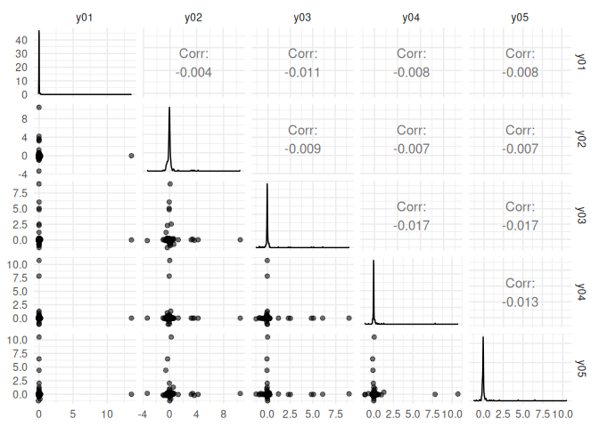
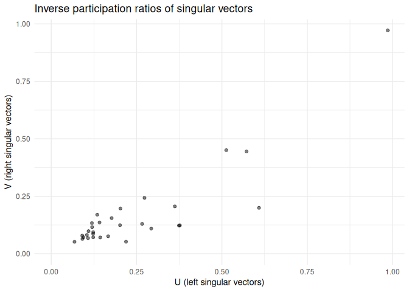

<!-- README.md is generated from README.Rmd. Please edit that file -->

# vsp

The goal of vsp is to …

## Installation

`vsp` is experimental and nascent. If you are a collaborator on the
project, you can install the development version with:

``` r
install.packages("devtools")
devtools::install_github("alexpghayes/vsp", auth_token = NEED_TO_DO_THIS)
```

You’ll need to set up a Github auth token. See the documentation in
`?remotes::install_github()` for details on how to do this.

## Example

Fitting a `vsp` factor analysis:

``` r
library(vsp)
library(Matrix)

# make a random sparse graph
M <- rsparsematrix(12, 12, nnz = 40)
M2 <- sign(M)^2

# vintage sparse pca
fa <- vsp(M2, k = 7)
fa
#> Vintage Sparse PCA Factor Analysis
#> 
#> Factors:  7 
#> Lambda_2: 0.41 
#> 
#> Pre-Processing Options
#> 
#>  - Centering:     FALSE 
#>  - Normalization: TRUE 
#>    - Tau (rows):  3.33 [Default: Mean Degree] 
#>    - Tau (cols):  3.33 [Default: Mean Degree] 
#> 
#> Components
#> 
#> U: 12 x 7 [matrix] 
#> d: 7      [numeric] 
#> V: 12 x 7 [matrix] 
#> Z: 12 x 7 [dgeMatrix] 
#> B: 7 x 7 [dgeMatrix] 
#> Y: 12 x 7 [dgeMatrix]
```

The screeplot:

``` r
screeplot(fa)
```


``` r
project_pca(fa)
#> # A tibble: 12 x 7
#>        PC1     PC2     PC3       PC4      PC5      PC6      PC7
#>      <dbl>   <dbl>   <dbl>     <dbl>    <dbl>    <dbl>    <dbl>
#>  1 -0.189  -0.0346 -0.0633  0.0181    0.118   -0.0102  -0.0861 
#>  2 -0.179   0.0986 -0.134  -0.00191   0.0160   0.114    0.0752 
#>  3 -0.0872  0.0796  0.0439  0.193     0.0459   0.0127   0.00371
#>  4 -0.144  -0.198  -0.155   0.0751   -0.0787  -0.00899 -0.0179 
#>  5 -0.0193 -0.0496 -0.0783  0.0513   -0.0829  -0.115    0.0845 
#>  6 -0.121   0.0923 -0.0100 -0.0799   -0.0202  -0.0958  -0.0541 
#>  7 -0.167   0.0933  0.136   0.134    -0.0406  -0.0374  -0.00203
#>  8 -0.228   0.0378  0.0521 -0.120    -0.0636  -0.00800  0.00977
#>  9 -0.127  -0.135   0.144  -0.0434    0.0307   0.0135   0.0905 
#> 10 -0.117  -0.172   0.0211 -0.0203    0.149   -0.0432   0.0217 
#> 11 -0.128  -0.136   0.0822 -0.000628 -0.119    0.0785  -0.0655 
#> 12 -0.199   0.155  -0.0429 -0.0463    0.00623 -0.0155   0.0120
```

``` r
project_varimax(fa)
#> # A tibble: 12 x 7
#>     factor1 factor2 factor3 factor4 factor5 factor6  factor7
#>       <dbl>   <dbl>   <dbl>   <dbl>   <dbl>   <dbl>    <dbl>
#>  1 -0.0931  -0.0383  0.0180  0.0622 -0.110   0.0196 -0.955  
#>  2  0.00859  0.0349 -0.0260 -0.0249  0.0132  1.13    0.00676
#>  3  0.361    0.106   0.0240  0.991  -0.0697  0.175  -0.202  
#>  4  0.122   -0.359  -0.868  -0.0775 -0.116   0.123  -0.267  
#>  5 -0.201    0.537  -1.13    0.137   0.160  -0.137   0.469  
#>  6 -0.879    0.142  -0.0557 -0.0179 -0.261  -0.345  -0.238  
#>  7 -0.207   -0.117  -0.0201  0.929   0.0718 -0.149   0.0953 
#>  8 -0.692   -0.259   0.0333 -0.0507  0.243   0.134   0.102  
#>  9 -0.0234  -0.115   0.0515  0.0611  1.06    0.0653  0.161  
#> 10  0.0908   0.263  -0.100  -0.107   0.747  -0.145  -0.670  
#> 11 -0.0295  -1.13   -0.0389  0.0471  0.0413 -0.0689  0.0265 
#> 12 -0.578    0.185   0.0427  0.131  -0.0800  0.384  -0.105
```

``` r
pairs(project_pca(fa))
```


``` r
pairs(project_varimax(fa))
```



think about how else to visualize these matrices. distributions of
loadings? am i actually plotting the loadings here or did i just do some
nonsense?

``` r
plot_simulation_test(M2, k = 3)
#> Loading required package: igraph
#> Warning: package 'igraph' was built under R version 3.5.1
#> 
#> Attaching package: 'igraph'
#> The following objects are masked from 'package:stats':
#> 
#>     decompose, spectrum
#> The following object is masked from 'package:base':
#> 
#>     union
#> `stat_bin()` using `bins = 30`. Pick better value with `binwidth`.
```



``` r
library(tidyverse)

fa$B %>%
  as.matrix() %>%
  as_tibble() %>%
  mutate(row = row_number()) %>%
  gather(k, v, -row) %>%
  ggplot(aes(row, k, fill = v)) +
  geom_tile() +
  scale_fill_viridis_c()

image(fa$B)
image(fa$Z)
```
