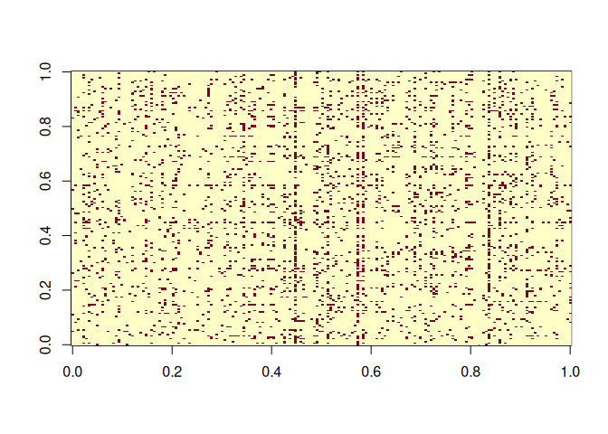

<!-- README.md is generated from README.Rmd. Please edit that file -->

# vsp

<!-- badges: start -->

[](https://app.codecov.io/gh/RoheLab/vsp?branch=main)
[](https://github.com/RoheLab/vsp/actions)
<!-- badges: end -->

The goal of `vsp` is to enable fast, spectral estimation of latent
factors in random dot product graphs. Under mild assumptions, the `vsp`
estimator is consistent for (degree-corrected) stochastic blockmodels,
(degree-corrected) mixed-membership stochastic blockmodels, and
degree-corrected overlapping stochastic blockmodels.

More generally, the `vsp` estimator is consistent for random dot product
graphs that can be written in the form

    E(A) = Z B Y^T

where `Z` and `Y` satisfy the varimax assumptions of \[1\]. `vsp` works
on directed and undirected graphs, and on weighted and unweighted
graphs. Note that `vsp` is a semi-parametric estimator.

## Installation

You can install the released version of `vsp` from CRAN with

``` r
install.packages("vsp")
```

You can install the development version of `vsp` with:

``` r
install.packages("devtools")
devtools::install_github("RoheLab/vsp")
```

## Example

Obtaining estimates from `vsp` is straightforward. We recommend
representing networks as [`igraph`](https://igraph.org/r/) objects or
sparse adjacency matrices using the
[`Matrix`](https://cran.r-project.org/package=Matrix) package. Once you
have your network in one of these formats, you can get estimates by
calling the `vsp()` function. The result is a `vsp_fa` S3 object.

Here we demonstrate `vsp` usage on an `igraph` object, using the `enron`
network from `igraphdata` package to demonstrate this functionality.
First we peak at the graph:

``` r
library(igraph)
data(enron, package = "igraphdata")

image(sign(get.adjacency(enron, sparse = FALSE)))
```



Now we estimate:

``` r
library(vsp)

fa <- vsp(enron, rank = 30)
fa
#> Vintage Sparse PCA Factor Analysis
#> 
#> Rows (n):   184
#> Cols (d):   184
#> Factors (rank): 30
#> Lambda[rank]:   0.2077
#> Components
#> 
#> Z: 184 x 30 [dgeMatrix] 
#> B: 30 x 30 [dgeMatrix] 
#> Y: 184 x 30 [dgeMatrix] 
#> u: 184 x 30 [matrix] 
#> d: 30      [numeric] 
#> v: 184 x 30 [matrix]
```

``` r
get_varimax_z(fa)
#> # A tibble: 184 × 31
#>    id         z01      z02      z03      z04      z05      z06      z07      z08
#>    <chr>    <dbl>    <dbl>    <dbl>    <dbl>    <dbl>    <dbl>    <dbl>    <dbl>
#>  1 row0…  2.42e-4 -0.00245 -2.99e-2  3.37e-4  9.96e-5 -0.0114  -0.00849  0.502  
#>  2 row0… -2.52e-3  0.00135  6.70e-4 -1.63e-1 -1.47e-2  0.0471   0.190    0.00181
#>  3 row0…  2.98e-4 -0.100    1.17e-4 -3.62e-3 -2.06e-2  0.187   -0.158    0.00303
#>  4 row0… -7.75e-5 -0.0183   1.17e-4  5.42e-2 -5.58e-3  0.00165 -0.0367  -0.00106
#>  5 row0… -2.31e-3  0.00150  2.57e-1 -1.42e-2 -4.38e-2  0.00629  1.18    -0.0179 
#>  6 row0… -3.46e-2 -0.0527  -2.61e-2 -1.26e-2 -1.83e-2  0.0282   0.408   -0.0286 
#>  7 row0… -1.08e-3 -0.327   -6.01e-1 -6.98e-2 -9.85e-2 -0.0709   0.509    0.0511 
#>  8 row0…  1.58e-2 -0.0518  -1.34e-2 -1.03e-2 -4.12e-3 -0.0139   0.225   -0.0244 
#>  9 row0…  2.22e-3  0.0752   3.30e-2 -6.50e-4 -5.00e-1 -0.0278  -0.0740  -0.00556
#> 10 row0…  7.13e-4 -0.0119   1.95e-2 -5.06e-3 -7.08e-3  0.00341 -0.00369 13.4    
#> # … with 174 more rows, and 22 more variables: z09 <dbl>, z10 <dbl>, z11 <dbl>,
#> #   z12 <dbl>, z13 <dbl>, z14 <dbl>, z15 <dbl>, z16 <dbl>, z17 <dbl>,
#> #   z18 <dbl>, z19 <dbl>, z20 <dbl>, z21 <dbl>, z22 <dbl>, z23 <dbl>,
#> #   z24 <dbl>, z25 <dbl>, z26 <dbl>, z27 <dbl>, z28 <dbl>, z29 <dbl>, z30 <dbl>
```

To visualize a screeplot of the singular value, use:

``` r
screeplot(fa)
```


At the moment, we also enjoy using pairs plots of the factors as a
diagnostic measure:

``` r
plot_varimax_z_pairs(fa, 1:5)
```


``` r
plot_varimax_y_pairs(fa, 1:5)
```


Similarly, an IPR pairs plot can be a good way to check for singular
vector localization (and thus overfitting!).

``` r
plot_ipr_pairs(fa)
```


``` r
plot_mixing_matrix(fa)
```


## References

1.  Rohe, K. & Zeng, M. *Vintage Factor Analysis with Varimax Performs
    Statistical Inference*. 2022+. <https://arxiv.org/abs/2004.05387>.

Code to reproduce the results from the paper is [available
here](https://github.com/RoheLab/vsp-paper).
